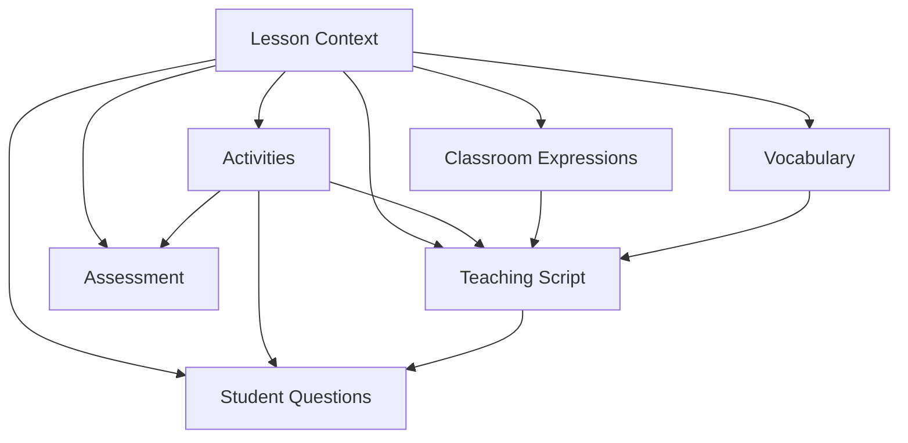
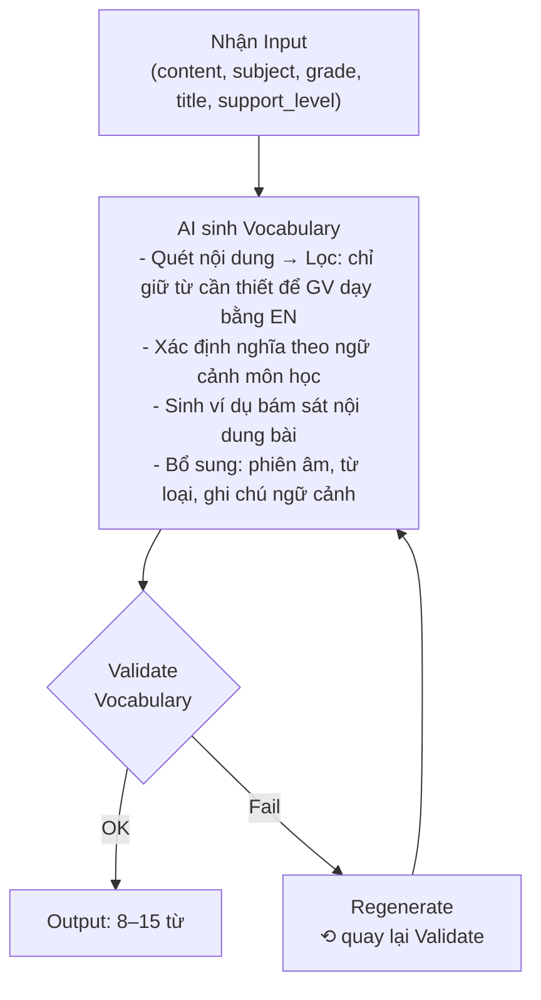
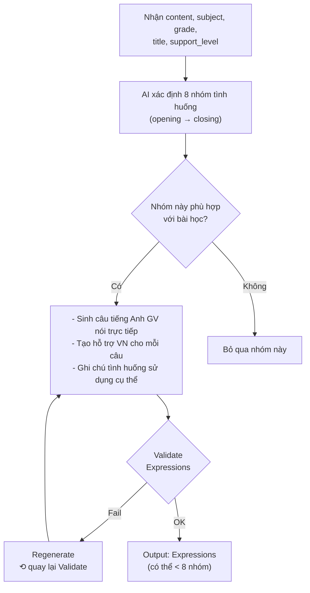
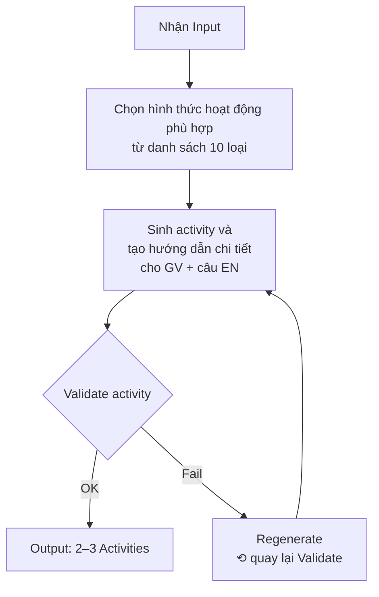
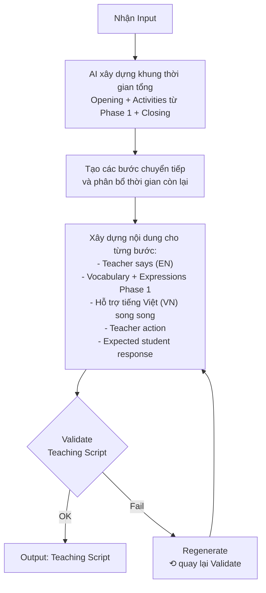
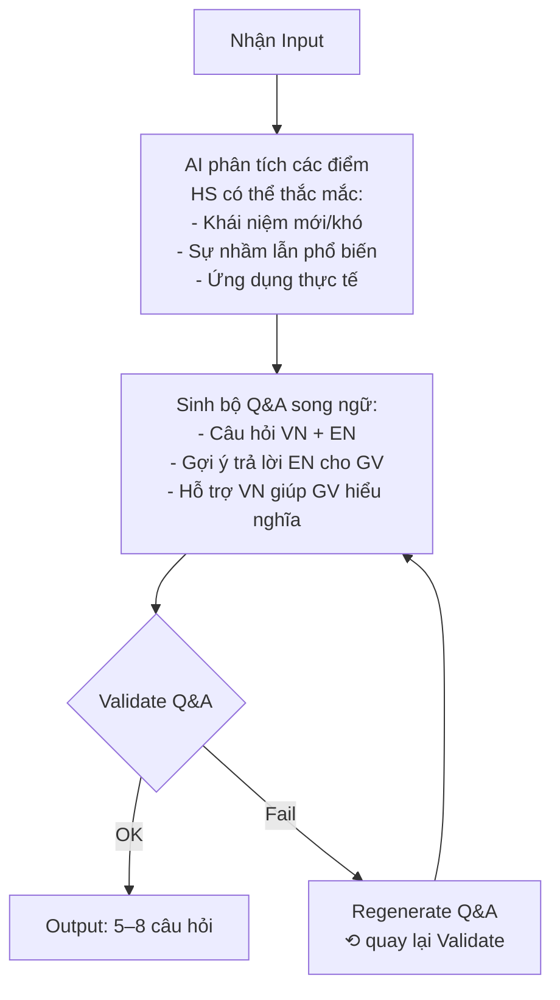
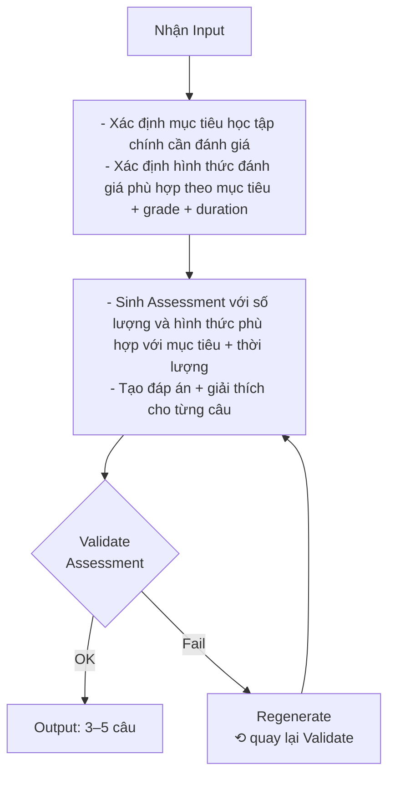
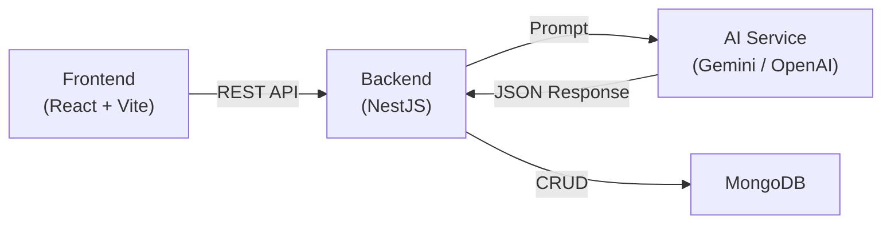

# Báo cáo Task: Lesson Kit Generator Thiết kế kỹ thuật & Báo cáo triển khai

---

## 1. Thiết kế kỹ thuật

### 1.1. Thiết kế cơ sở dữ liệu

| # | Collection | Mô tả | Quan hệ |
| --- | --- | --- | --- |
| 1 | `lesson_contents` | Dữ liệu bài học gốc | Nguồn dữ liệu chính |
| 2 | `lesson_kits` | Entity quản lý một Lesson Kit, liên kết với các thành phần nội dung được sinh ra. | FK → lesson_contents |
| 3 | `vocabularies` | Từ vựng chuyên ngành (8–15 từ/bài) | FK → lesson_kits |
| 4 | `classroom_expressions` | Mẫu câu trên lớp (8 nhóm, 3–5 câu/nhóm) | FK → lesson_kits |
| 5 | `teaching_scripts` | Kịch bản giảng từng bước (song ngữ song song) | FK → lesson_kits |
| 6 | `activities` | Gợi ý hoạt động (2–3 hoạt động/bài) | FK → lesson_kits |
| 7 | `student_questions` | Dự đoán câu hỏi HS (5–8 câu/bài) | FK → lesson_kits |
| 8 | `assessments` | Nội dung đánh giá cuối giờ (3–5 câu) | FK → lesson_kits |

---

[Lesson Kit Generator - Database Schema](https://app.notion.com/p/Lesson-Kit-Generator-Database-Schema-3c268a19790280b2a8c6cd1a894b7169?pvs=21) 

### 1.2. Flow xử lý của từng nội dung

> Mô tả luồng: **Input → Xử lý → Output** cho từng nội dung trong Lesson Kit.
> 

**Phase 1:** Từ Lesson Context → sinh song song 3 phần độc lập: Vocabulary (8–15 từ vựng chuyên ngành được lấy trong bài học), Classroom Expressions (mẫu câu theo nhóm tình huống), Activities (2–3 hoạt động).

**Phase 2:** Lấy kết quả Phase 1 (từ vựng + mẫu câu + hoạt động) + Lesson Context → sinh Teaching Script: xây khung thời gian tổng, giữ đúng tên và thời lượng các hoạt động từ Phase 1, lấp thời gian còn lại bằng mở đầu/giảng bài/tổng kết, viết song ngữ EN-VN từng bước.

**Phase 3:** Lấy kết quả Phase 2 (kịch bản giảng) + Activities + Lesson Context → sinh song song 2 phần: Student Questions (5–8 câu HS có thể hỏi + gợi ý trả lời song ngữ) và Assessment (3–5 câu đánh giá cuối giờ, bám mục tiêu bài).

#### Chi tiết từng phần

#### a. Tạo từ vựng(Phase 1)

**Input đầu vào:**

- Nội dung bài học (`content`), môn học (`subject`), khối (`grade`), tên bài (`title`)
- Cấp độ tiếng Anh (`support_level`: A1, A2, B1, B2, C1, C2)

#### Cơ chế đảm bảo chất lượng

| Vấn đề | Cách xử lý |
| --- | --- |
| Từ vựng không liên quan đến bài | Kiểm tra mức độ liên quan với Lesson Context và mục tiêu bài học; ưu tiên từ xuất hiện trong nội dung hoặc có quan hệ trực tiếp với kiến thức cần dạy. Không dùng điều kiện “phải xuất hiện nguyên văn” làm rule duy nhất. |
| Nghĩa sai ngữ cảnh | Prompt cho ví dụ cụ thể sai/đúng  |
| Ví dụ không bám bài | Prompt ràng buộc: “BẮT BUỘC phải được lấy từ hoặc có liên quan chặt chẽ đến nội dung bài học.” |
| Phiên âm sai | Kiểm tra IPA bằng dictionary API |

**Output (8–15 từ/bài):**

| Từ | Phiên âm | Nghĩa trong bài | Ví dụ |
| --- | --- | --- | --- |
| physics | /ˈfɪzɪks/ | vật lí | Physics is the study of matter, energy and motion. |
| matter | /ˈmæt.ər/ | vật chất (không phải “vấn đề”) | Matter is anything that has mass and takes up space. |
| field | /fiːld/ | trường (dạng vật chất, không phải “cánh đồng”) | A magnetic field surrounds a magnet. |
| observation | /ˌɒbzəˈveɪʃən/ | quan sát | Scientific observation requires careful attention to detail. |
| measurement | /ˈmɛʒəmənt/ | phép đo lường | Accurate measurement is fundamental in physics. |

**Tiêu chí đánh giá output:**

- Nghĩa của từ phải đúng theo ngữ cảnh môn học/bài học, không dùng nghĩa phổ thông nếu không phù hợp (VD: `matter` = “vật chất”, không phải “vấn đề”; `field` = “trường”, không phải “cánh đồng”)
- Ví dụ minh hoạ phải bám sát nội dung bài học, được lấy từ nội dung bài, không sinh ví dụ không liên quan
- Phiên âm IPA chính xác
- Phù hợp với khối lớp và độ phức tạp bài
- Có khả năng sử dụng thực tế trong bài.

#### b. Tạo mẫu câu trên lớp(Phase 1)

**Input đầu vào:**

- Nội dung bài học (`content`), môn học (`subject`), khối (`grade`), tên bài (`title`)
- Cấp độ tiếng Anh (`support_level`: A1, A2, B1, B2, C1, C2)

Các nhóm tình huống đề xuất:

- **Mở đầu / Khởi động**
- **Giới thiệu nội dung**
- **Hướng dẫn nhiệm vụ**
- **Đặt câu hỏi / Gợi mở**
- **Kiểm tra mức độ hiểu**
- **Khuyến khích / Phản hồi học sinh**
- **Chuyển hoạt động**
- **Tổng kết / Kết thúc**

Có thể bỏ nhóm không phù hợp với bài học.

Cấp độ tiếng Anh (Khung chuẩn CEFR / Khung 6 bậc):

- **A1 (Beginner - Bậc 1):** Hiểu và dùng câu/cụm từ rất cơ bản; giao tiếp đơn giản khi người đối thoại nói chậm, rõ ràng.
- **A2 (Elementary - Bậc 2):** Hiểu các câu thông dụng về nhu cầu thiết yếu hàng ngày; trao đổi thông tin trực tiếp về chủ đề quen thuộc.
- **B1 (Intermediate - Bậc 3):** Hiểu các ý chính về học tập/công việc; diễn đạt kết nối các ý đơn giản và xử lý tình huống phát sinh thường gặp.
- **B2 (Upper Intermediate - Bậc 4):** Hiểu ý chính bài phức tạp/học thuật; giao tiếp tự nhiên, lưu loát với người bản ngữ; diễn đạt chi tiết đa chủ đề.
- **C1 (Advanced - Bậc 5):** Hiểu sâu văn bản dài và khó; diễn đạt trôi chảy, tự nhiên; dùng linh hoạt cho mục đích học thuật và chuyên môn.
- **C2 (Proficiency - Bậc 6):** Hiểu dễ dàng hầu như toàn bộ thông tin nghe/đọc; diễn đạt chuẩn xác, lưu loát và phân biệt tinh tế các sắc thái nghĩa.

**Output (8 nhóm × 3–5 câu/nhóm):**

| Nhóm | Câu tiếng Anh | Nghĩa/hỗ trợ VN | Tình huống |
| --- | --- | --- | --- |
| Mở đầu | “Good morning! Today we’re going to learn about uniform motion.” | “Chào cả lớp! Hôm nay chúng ta sẽ học về chuyển động thẳng đều.” | Khi bắt đầu tiết học |
| Đặt câu hỏi | “Can anyone tell me what happens to the velocity when there is no net force?” | “Bạn nào có thể cho cô biết vận tốc sẽ thế nào khi không có ngoại lực tác dụng?” | Kiểm tra kiến thức HS |
| Khuyến khích | “Excellent! That’s a perfect example of Newton’s first law.” | “Xuất sắc! Đó là một ví dụ hoàn hảo về định luật 1 Newton.” | Phản hồi tích cực cho HS |

**Tiêu chí đánh giá output:**

- Đúng tình huống lớp học thực tế
- Câu tiếng Anh tự nhiên, GV có thể nói trực tiếp
- Phù hợp cấp độ tiếng Anh đã chọn (A1 / A2 / B1 / B2 / C1 / C2)
- Liên quan đến nội dung bài học
- AI có thể bỏ nhóm không phù hợp (không ép đủ 8 nhóm)

#### c. Gợi ý hoạt động(Phase 1)

**Input đầu vào:**

- Nội dung bài học (`content`), môn học (`subject`), khối (`grade`), tên bài (`title`)
- Thời lượng (`duration`), Cấp độ tiếng Anh (`support_level`: A1, A2, B1, B2, C1, C2)

Các loại hoạt động đề xuất:

1. Hỏi đáp
2. Think-Pair-Share
3. Thảo luận nhóm
4. Matching
5. Role-play
6. Quiz
7. Problem solving
8. Game
9. Presentation
10. Practice task

**Output (2–3 hoạt động/bài):**

| Tên hoạt động | Hình thức | Mục tiêu | Thời lượng | Hình thức nhóm | Hướng dẫn GV | Câu tiếng Anh GV dùng | Nhiệm vụ HS | Kết quả dự kiến |
| --- | --- | --- | --- | --- | --- | --- | --- | --- |
| Velocity vs Speed | Think-Pair-Share | Phân biệt vận tốc và tốc độ | 8 phút | pair | 1. Đặt câu hỏi → 2. HS suy nghĩ 1p → 3. Thảo luận cặp 3p → 4. Chia sẻ lớp 4p | “Think about this question for one minute, then discuss with your partner…” | So sánh velocity và speed, tìm ví dụ thực tế | HS nêu được: velocity có hướng, speed không có hướng |

**Tiêu chí đánh giá output:**

- Hoạt động phải **phục vụ mục tiêu bài học** (không chỉ tạo trò chơi cho vui)
- Phù hợp lớp/độ tuổi
- Có thể triển khai thực tế trong lớp
- Phù hợp thời lượng
- Có hướng dẫn rõ ràng cho cả GV và HS

#### d. Tạo kịch bản giảng(Phase 2)

**Input đầu vào:**

- Nội dung bài học (`content`), môn học (`subject`), khối (`grade`), tên bài (`title`)
- Kết quả Phase 1: Vocabulary, Expressions, Activities
- Thời lượng (`duration`), Cấp độ tiếng Anh (`support_level`: A1, A2, B1, B2, C1, C2)

> Lưu ý: Kịch bản giảng không được sinh độc lập, nó phải tích hợp từ vựng, mẫu câu và hoạt động đã sinh ở Phase 1.
> 
> 
> Phải có prompt ràng buộc: “QUAN TRỌNG: BẮT BUỘC phải đưa tất cả hoạt động được liệt kê ở trên vào kịch bản giảng. Sử dụng ĐÚNG TÊN và ĐÚNG THỜI LƯỢNG của từng hoạt động như đã được cung cấp.”
> 

**Output (từng bước/hoạt động, song ngữ song song):**

| Hoạt động | Thời lượng | Mục tiêu | Teacher says (EN) | Hỗ trợ (VN) | Teacher action | Expected student response |
| --- | --- | --- | --- | --- | --- | --- |
| Khởi động | 5 phút | Ôn tập, kích hoạt tư duy | “Good morning! Before we begin today’s lesson about uniform motion, let me ask you…” | “Chào cả lớp! Trước khi bắt đầu bài hôm nay về chuyển động thẳng đều, cô muốn hỏi…” | Viết từ khóa lên bảng, sử dụng hình ảnh minh hoạ | HS trả lời câu hỏi mở, nêu ví dụ thực tế |
| Giảng bài mới | 20 phút | Truyền đạt kiến thức trọng tâm | “Now, let’s look at the formula for uniform motion: s equals v times t…” | “Bây giờ, hãy xem công thức chuyển động thẳng đều: s bằng v nhân t…” | Trình chiếu slide, vẽ đồ thị trên bảng | HS ghi chép, đặt câu hỏi khi cần |
| Luyện tập | 15 phút | Vận dụng kiến thức | “Let’s practice! Work with your partner to solve problem 1…” | “Hãy luyện tập nào! Làm việc với bạn cạnh để giải bài 1…” | Phát phiếu bài tập, hỗ trợ các nhóm | HS giải bài theo cặp, trình bày kết quả |
| Tổng kết | 5 phút | Củng cố, đánh giá | “Before we finish, let me review the key points…” | “Trước khi kết thúc, cô sẽ ôn lại các điểm chính…” | Tóm tắt bài, giao bài tập về nhà | HS trả lời câu hỏi tổng kết |

**Tiêu chí đánh giá output:**

- Bám cấu trúc/nội dung bài học và kết quả Phase 1.
- Trình tự logic, tổng thời lượng của toàn bộ script bằng đúng `duration` đã chọn.
- Tất cả Activities từ Phase 1 phải được đưa vào script, giữ đúng tên và đúng thời lượng đã được sinh ở Phase 1.
- Mỗi bước phải có đầy đủ: Bước/Hoạt động, Thời lượng, Mục tiêu, Teacher says (EN), Hỗ trợ (VN), Teacher action, Expected student response.
- GV có thể nhìn vào và sử dụng trực tiếp (không phải đọc hướng dẫn phương pháp).
- Song ngữ song song: EN và VN nằm cùng nội dung/bước tương ứng, không tách thành hai bản.
- Phần hỗ trợ tiếng Việt chính xác và phù hợp với nội dung English.
- Nếu bất kỳ tiêu chí nào không đạt → không trả Output, chỉ regenerate Teaching Script.

#### e. Dự đoán câu hỏi học sinh(Phase 3)

**Input đầu vào:**

- Nội dung bài học (`content`), môn học (`subject`), khối (`grade`)
- Mục tiêu học tập / YCCĐ (nếu có)
- Kết quả Phase 2: Teaching Script, Activities

**Căn cứ dự đoán:**

| Nguồn | AI khai thác thế nào |
| --- | --- |
| **Lesson Context** | Xác định khái niệm mới, công thức phức tạp, thuật ngữ dễ nhầm |
| **Teaching Script** | Xem GV sẽ nói gì → dự đoán HS sẽ hỏi gì tại bước đó |
| **Activities** | Trong quá trình làm activity, HS có thể gặp khó khăn gì |

**Prompt ràng buộc quan trọng:**
- “Tập trung vào những câu hỏi có khả năng thực sự phát sinh trong quá trình học.” → không sinh câu hỏi lý thuyết thuần túy
- “Câu trả lời phải chính xác và phù hợp với nội dung bài học.” → đáp án phải đúng nội dung bài
- “Câu trả lời bằng tiếng Anh phải tự nhiên và có thể được giáo viên nói trực tiếp trên lớp.” → câu trả lời EN phải tự nhiên, nói được ngay

**Output (5–8 câu/bài):**

| Câu hỏi HS (VN) | Câu hỏi (EN) | Gợi ý trả lời (EN) | Hỗ trợ (VN) |
| --- | --- | --- | --- |
| Thầy ơi, velocity với speed khác nhau chỗ nào? | What is the difference between velocity and speed? | Good question! Velocity has both magnitude and direction, while speed only has magnitude. | Câu hỏi hay! Velocity có cả độ lớn và hướng, còn speed chỉ có độ lớn. |
| Tại sao vật lại không dừng lại nếu không có lực tác dụng? | Why doesn’t an object stop if there is no force acting on it? | This is Newton’s first law – an object in motion stays in motion unless acted on by a force. | Đây là định luật 1 Newton – vật đang chuyển động sẽ tiếp tục chuyển động nếu không có lực tác dụng. |

**Tiêu chí đánh giá output:**

- Câu hỏi có **khả năng thực sự phát sinh** trong quá trình học
- Câu trả lời đúng nội dung bài
- Gợi ý trả lời bằng tiếng Anh GV **có thể sử dụng trực tiếp**
- Phần hỗ trợ tiếng Việt chính xác

#### f. Tạo nội dung đánh giá

**Input đầu vào:**

- Nội dung bài học (`content`), môn học (`subject`), khối (`grade`)
- Mục tiêu học tập / YCCĐ **(nếu có)**
- Thời lượng bài học (`duration`)
- Kết quả Phase 1: Activities
- Kết quả Phase 2: Teaching Script

Hình thức có thể gồm:

- Multiple choice
- True/False
- Matching
- Short answer
- Câu hỏi vận dụng ngắn

AI lựa chọn hình thức phù hợp dựa trên mục tiêu/YCCĐ, nội dung bài, khối lớp và thời lượng, có thể kết hợp nhiều hình thức.

**Output (3–5 câu, cho 5–10 phút cuối giờ):**

| Câu hỏi | Loại | Đáp án | Giải thích |
| --- | --- | --- | --- |
| What is the formula for uniform motion? | multiple_choice | A. s = v.t | In uniform motion, distance equals velocity multiplied by time. |
| True or False: Velocity and speed are the same thing. | true_false | False | Velocity is a vector (has direction), speed is a scalar (no direction). |
| Match the physics term with its Vietnamese meaning: 1. matter, 2. force → a. lực, b. vật chất | matching | 1-b, 2-a | matter = vật chất, force = lực |

**Tiêu chí đánh giá output:**

- Bám nội dung/mục tiêu bài học
- Câu hỏi rõ ràng, đáp án chính xác
- Độ khó phù hợp lớp
- Có thể hoàn thành trong **5–10 phút cuối giờ**
- Tập trung **kiểm tra mức độ tiếp thu nội dung bài học**

---

### 1.3. Danh sách API triển khai

| STT | API | Method | Mô tả | Input | Output |
| --- | --- | --- | --- | --- | --- |
| 1 | `/api/config/subjects` | GET | Danh sách môn học | – | `[{code, name}]` |
| 2 | `/api/config/options` | GET | Options: thời lượng, cấp độ tiếng Anh (A1, A2, B1, B2, C1, C2) | – | `{durations, support_levels}` |
| 3 | `/api/lessons?subject=&grade=` | GET | Danh sách bài học theo môn + lớp | Query params: subject, grade | `[{_id, title, lesson, grade]` |
| 4 | `/api/lesson-kit/generate` | POST | Tạo Lesson Kit mới | Body: `{subject, grade, lesson_topic, duration, support_level (A1, A2, B1, B2, C1, C2)}` | `{lesson_kit_id, status}` |
| 5 | `/api/lesson-kit` | GET | Danh sách tất cả Lesson Kit | – | `[{_id, subject, grade, lesson_topic, status, ...]` |
| 6 | `/api/lesson-kit/:id` | GET | Chi tiết 1 Lesson Kit + 6 components | Param: id | `{lesson_kit, vocabulary[], expressions[], script[], activities[], questions[], assessment[]}` |
| 7 | `/api/lesson-kit/:id/status` | GET | Trạng thái sinh | Param: id | `{status, current_step, generation_time_ms}` |
| 8 | `/api/lesson-kit/:id/regenerate/:component` | POST | Tạo lại 1 component riêng lẻ | Param: id, component | `{status: "regenerated", component}` |
| 9 | `/api/lesson-kit/:id` | DELETE | Xóa 1 Lesson Kit và toàn bộ components | Param: id | `{status: "deleted", id}` |

**Giá trị `component` khi regenerate:**

| component | Mô tả | Phạm vi ảnh hưởng |
| --- | --- | --- |
| `vocabulary` | Từ vựng | Chỉ vocabulary |
| `expressions` | Mẫu câu trên lớp | Chỉ expressions |
| `script` | Kịch bản giảng | Script (có thể cần cập nhật nếu vocab/expressions thay đổi) |
| `activities` | Hoạt động | Chỉ activities |
| `questions` | Câu hỏi HS | Chỉ questions |
| `assessment` | Đánh giá | Chỉ assessment |

## 2. Kiến trúc tổng quan

| Thành phần | Công nghệ | Vai trò |
| --- | --- | --- |
| Frontend | React + Vite | Giao diện người dùng: form tạo Lesson Kit, xem kết quả, regenerate |
| Backend | NestJS | Xử lý logic pipeline, gọi AI, lưu trữ dữ liệu |
| AI Service | Google Gemini / OpenAI | Sinh nội dung: vocabulary, expressions, activities, script, Q&A, assessment |
| Database | MongoDB  | Lưu trữ lesson contents, lesson kits và 6 components |

---

## 3. Xử lý một số lỗi

| Tình huống | Cách xử lý |
| --- | --- |
| AI trả response không parse được JSON | Retry tối đa 3 lần |
| AI trả JSON nhưng thiếu required fields | Validate structure trước khi lưu DB, báo lỗi cụ thể, retry tối đa 3 lần |
| Pipeline fail giữa chừng | Đánh dấu `status: failed`, ghi lại `current_step` bị lỗi |
| User hủy Lesson Kit đang generate | Kiểm tra `status` trước mỗi phase, dừng lại nếu không còn `generating` |
| Network timeout khi gọi AI | Retry tối đa 3 lần |