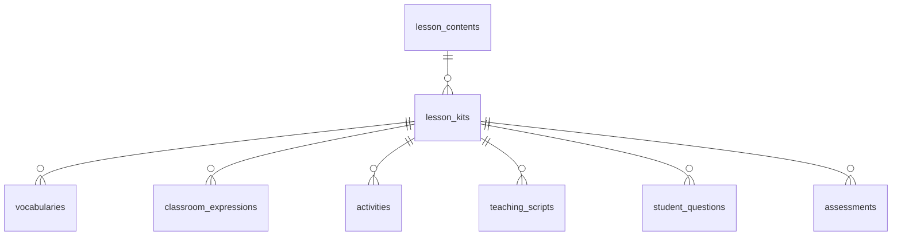

# Lesson Kit Generator - Database Schema

---

## Mô hình quan hệ dữ liệu

## 1. lesson_contents — Nội dung bài học gốc

Dữ liệu bài học gốc của các bài học.

| Trường | Kiểu dữ liệu | Mô tả |
| --- | --- | --- |
| `_id` | ObjectId | Khóa chính, tự sinh |
| `grade` | String | Khối lớp: `"10"`, `"11"`, `"12"` |
| `lesson` | String | Index bài trong sách (thứ tự mục lục) |
| `subject` | String | Môn học: `"VAT_LI"` |
| `title` | String | Tên bài học |
| `content` | String | Nội dung đầy đủ bài học |
| `createdAt` | Date | Thời điểm tạo  |
| `updatedAt` | Date | Thời điểm cập nhật  |

---

## 2. lesson_kits

Entity quản lý một Lesson Kit, liên kết với các thành phần nội dung được sinh ra.

| Trường | Kiểu dữ liệu | Mô tả |
| --- | --- | --- |
| `_id` | ObjectId | Khóa chính, tự sinh |
| `subject` | String | Môn học |
| `grade` | String | Khối lớp |
| `lesson_topic` | String | Tên bài học đã chọn |
| `duration` | Number | Thời lượng tiết học: `35`, `40`, `45` phút |
| `support_level` | String | Cấp độ tiếng Anh: `A1` / `A2` / `B1` / `B2` / `C1` / `C2` |
| `status` | String (enum) | Trạng thái: `draft` · `generating` · `completed` · `failed` |
| `ai_model_version` | String | Model AI đã sử dụng (VD: `gemini-3.6-flash`) |
| `generation_time_ms` | Number | Thời gian sinh toàn bộ kit |
| `request_id` | String | ID request debug |
| `lesson_content_id` | ObjectId | FK → `lesson_contents._id` (bài học gốc) |
| `current_step` | String | Bước đang xử lý  |
| `createdAt` | Date | Thời điểm tạo |
| `updatedAt` | Date | Thời điểm cập nhật |

---

## 3. vocabularies — Từ vựng chuyên ngành

| Trường | Kiểu dữ liệu | Mô tả |
| --- | --- | --- |
| `_id` | ObjectId | Khóa chính |
| `lesson_kit_id` | ObjectId | FK → `lesson_kits._id` |
| `word` | String | Từ vựng tiếng Anh |
| `phonetic` | String | Phiên âm IPA |
| `meaning_vi` | String | Nghĩa tiếng Việt theo ngữ cảnh bài (không dùng nghĩa phổ thông) |
| `part_of_speech` | String | Loại từ: `noun`, `verb`, `adj`... |
| `example_sentence` | String  | Ví dụ lấy từ nội dung bài học |
| `context_note` | String  | Ghi chú ngữ cảnh sử dụng |
| `sort_order` | Number | Thứ tự hiển thị |
| `createdAt` | Date | Thời điểm tạo |
| `updatedAt` | Date | Thời điểm cập nhật |

---

## 4. classroom_expressions — Mẫu câu giao tiếp lớp họ

| Trường | Kiểu dữ liệu | Mô tả |
| --- | --- | --- |
| `_id` | ObjectId | Khóa chính |
| `lesson_kit_id` | ObjectId | FK → `lesson_kits._id` |
| `category` | String | Nhóm mẫu câu: `opening` · `content_intro` · `instruction` · `questioning` 
`comprehension_check` · `encouragement` · `transition` · `closing` |
| `expression_en` | String  | Câu tiếng Anh GV nói trực tiếp |
| `translation_vi` | String | Nghĩa / hỗ trợ tiếng Việt |
| `situation_note` | String  | Tình huống sử dụng |
| `sort_order` | Number | Thứ tự |
| `createdAt` | Date | Thời điểm tạo |
| `updatedAt` | Date | Thời điểm cập nhật |

---

## 5. activities — Hoạt động tương tác

| Trường | Kiểu dữ liệu | Mô tả |
| --- | --- | --- |
| `_id` | ObjectId | Khóa chính |
| `lesson_kit_id` | ObjectId | FK → `lesson_kits._id` |
| `activity_name` | String | Tên hoạt động |
| `activity_type` | String | Hình thức: `Think-Pair-Share` · `Matching` · `Role-play` · `Quiz` · `Discussion`... |
| `description` | String  | Mô tả ngắn hoạt động |
| `objective` | String  | Mục tiêu hoạt động |
| `duration_minutes` | Number | Thời lượng (phút) |
| `group_type` | String | Hình thức nhóm: `individual` / `pair` / `group` / `whole_class` |
| `instructions` | String | Hướng dẫn chi tiết cho GV |
| `english_instructions` | Strin | Câu tiếng Anh GV sử dụng khi tổ chức |
| `student_task` | String | Nhiệm vụ cụ thể của HS |
| `expected_outcome` | String | Kết quả dự kiến |
| `sort_order` | Number | Thứ tự |
| `createdAt` | Date | Thời điểm tạo |
| `updatedAt` | Date | Thời điểm cập nhật |

---

## 6. teaching_scripts — Kịch bản giảng dạy

| Trường | Kiểu dữ liệu | Mô tả |
| --- | --- | --- |
| `_id` | ObjectId | Khóa chính |
| `lesson_kit_id` | ObjectId | FK → `lesson_kits._id` |
| `activity_name` | String | Tên hoạt động (VD: Khởi động, Giảng bài mới) |
| `duration_minutes` | Number | Thời lượng bước này (phút) |
| `objective` | String | Mục tiêu hoạt động |
| `teacher_speech_en` | String  | Câu tiếng Anh GV sử dụng trực tiếp |
| `teacher_speech_vi` | String  | Hỗ trợ / giải thích tiếng Việt |
| `teacher_action` | String  | GV cần làm gì (hành động cụ thể) |
| `expected_student_response` | String | Phản hồi dự kiến của HS |
| `notes` | String | Ghi chú thêm |
| `step_order` | Number | Thứ tự bước trong kịch bản |
| `createdAt` | Date | Thời điểm tạo |
| `updatedAt` | Date | Thời điểm cập nhật |

---

## 7. student_questions — Câu hỏi dự kiến của HS

| Trường | Kiểu dữ liệu | Mô tả |
| --- | --- | --- |
| `_id` | ObjectId | Khóa chính |
| `lesson_kit_id` | ObjectId | FK → `lesson_kits._id` |
| `question_vi` | String | Câu hỏi HS bằng tiếng Việt |
| `question_en` | String | Câu hỏi dịch sang tiếng Anh |
| `suggested_answer_en` | String | Gợi ý trả lời bằng tiếng Anh |
| `suggested_answer_vi` | String | Hỗ trợ / diễn giải tiếng Việt |
| `sort_order` | Number | Thứ tự |
| `createdAt` | Date | Thời điểm tạo |
| `updatedAt` | Date | Thời điểm cập nhật |

---

## 8. assessments — Đánh giá cuối bài

3–5 câu, 5–10 phút cuối giờ. Kiểm tra tiếp thu nội dung, KHÔNG đánh giá tiếng Anh.

| Trường | Kiểu dữ liệu | Mô tả |
| --- | --- | --- |
| `_id` | ObjectId | Khóa chính |
| `lesson_kit_id` | ObjectId | FK → `lesson_kits._id` |
| `question_text` | String (text) | Nội dung câu hỏi |
| `question_type` | String | Loại câu hỏi: `multiple_choice` / `true_false` / `matching` / `short_answer` |
| `options` | String[] | Các đáp án (nếu MC / TF) |
| `correct_answer` | String (text) | Đáp án đúng |
| `explanation` | String (text) | Giải thích đáp án |
| `sort_order` | Number | Thứ tự |
| `createdAt` | Date | Thời điểm tạo |
| `updatedAt` | Date | Thời điểm cập nhật |

---