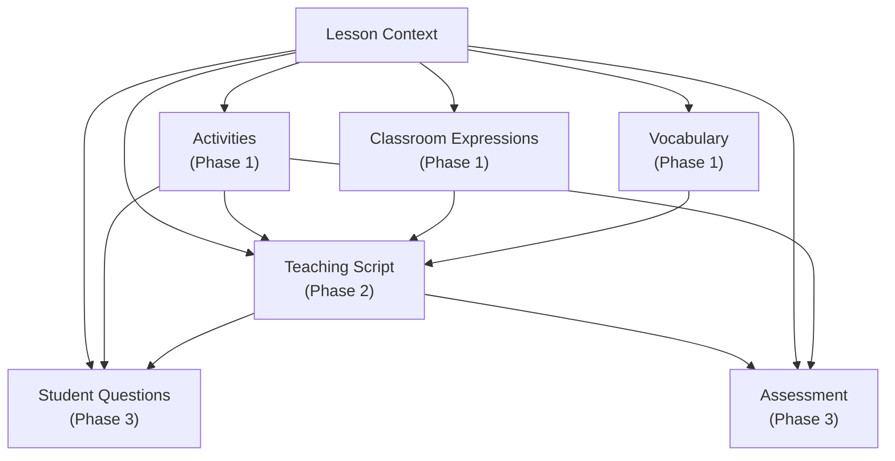
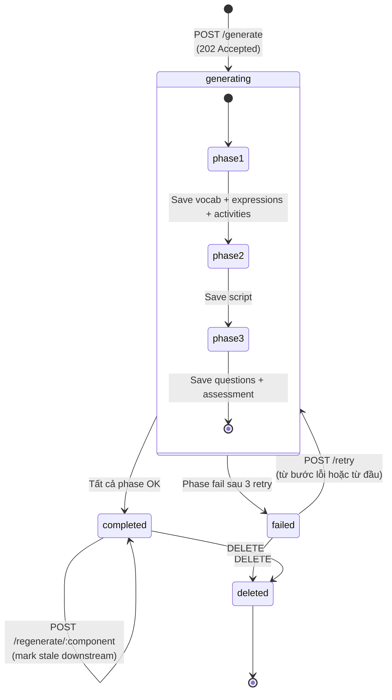
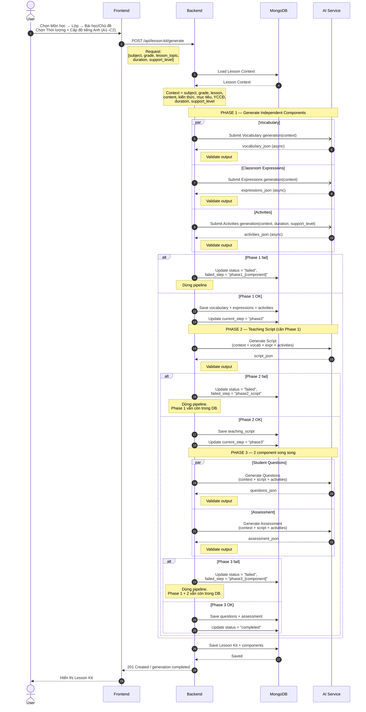
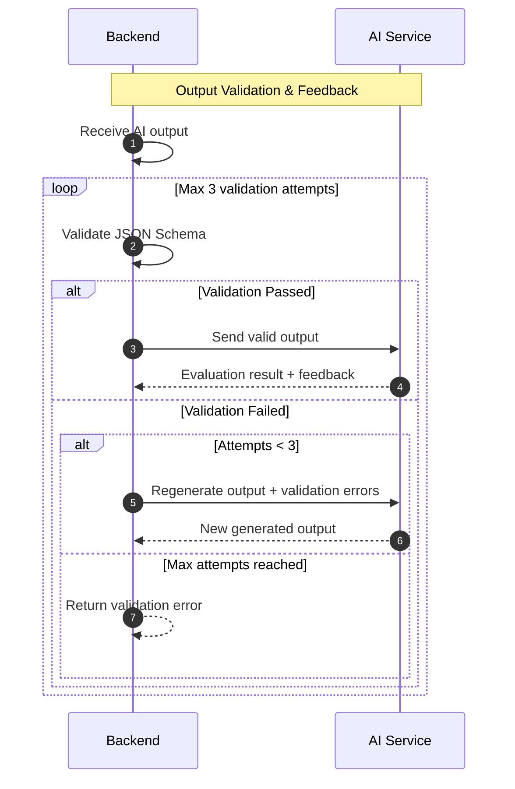
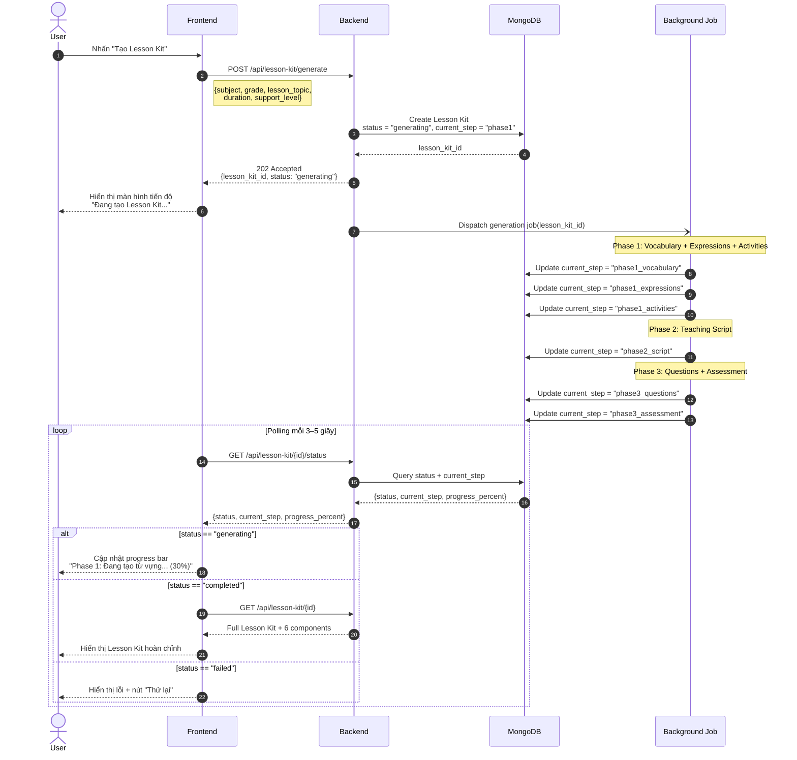
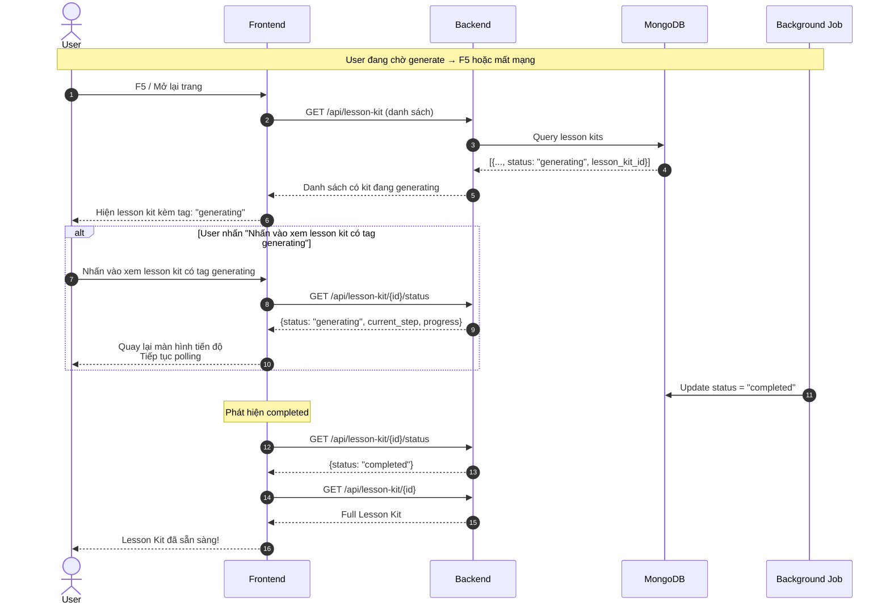
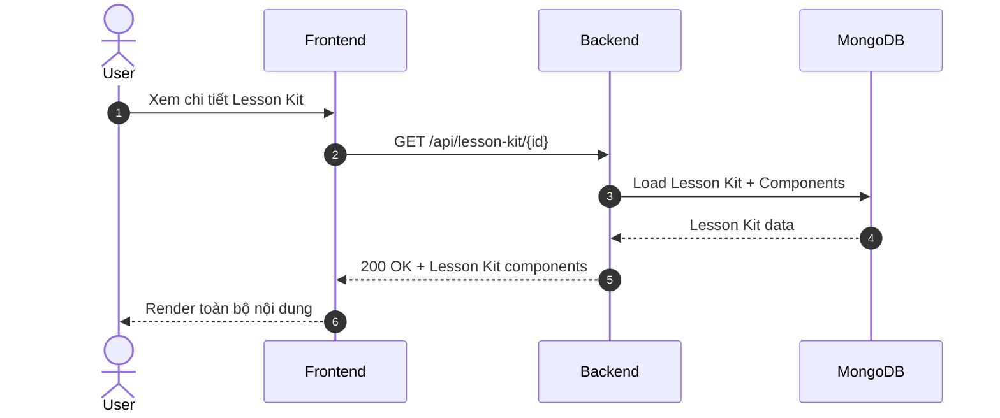
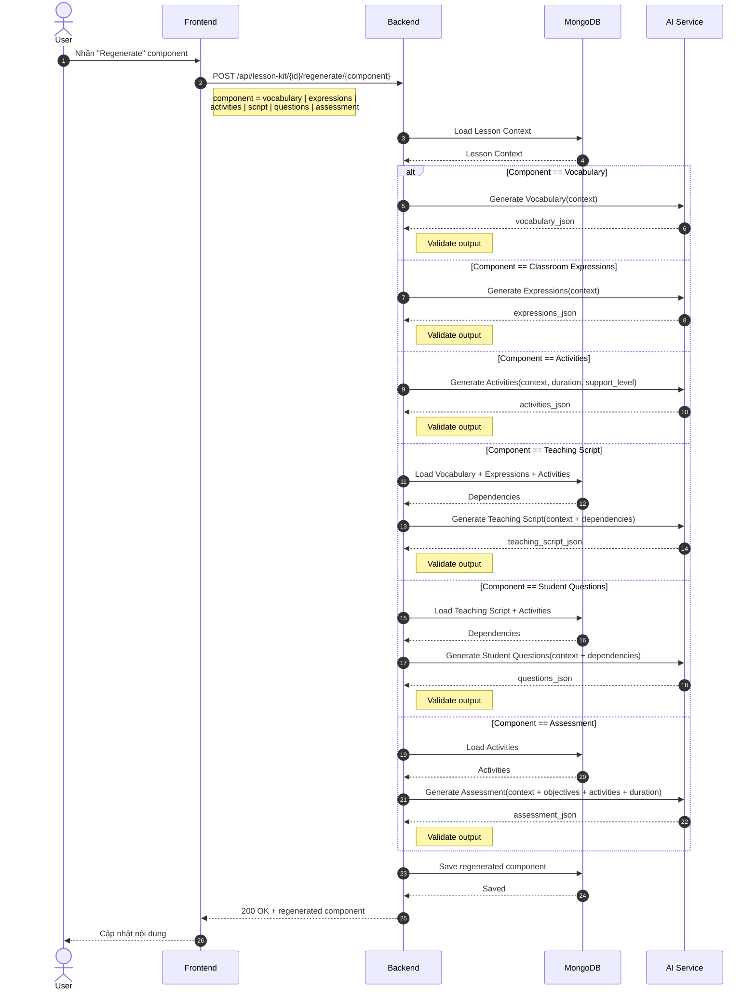
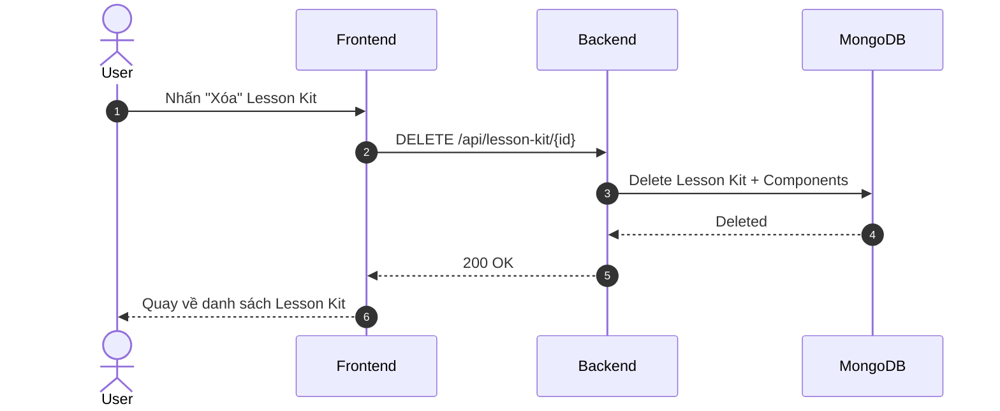

# Sequence Diagram — Lesson Kit Generator

## 1. Sơ đồ phụ thuộc component

**Bảng ảnh hưởng khi regenerate:**

| Regenerate | Downstream bị ảnh hưởng | Cần mark stale |
| --- | --- | --- |
| `vocabulary` | `script` → `questions`, `assessment` | script, questions, assessment |
| `expressions` | `script` → `questions`, `assessment` | script, questions, assessment |
| `activities` | `script` → `questions`, `assessment` | script, questions, assessment |
| `script` | `questions`, `assessment` | questions, assessment |
| `questions` | *(leaf node)* | — |
| `assessment` | *(leaf node)* | — |

## **2. Lesson Kit — State Diagram**

## 3. Main Flow — Tạo Lesson Kit

### 3.1 Validate output

Evaluation result + feedback được lưu để làm dữ liệu huấn luyện, cải thiện AI

## 3.2 Frontend Async Flow

### 3.3 Xử lý khi User mất mạng / F5 / đóng tab

---

## 4. Xem chi tiết Lesson Kit

---

## 5. Regenerate 1 Component

---

## 6. Xóa Lesson Kit

---