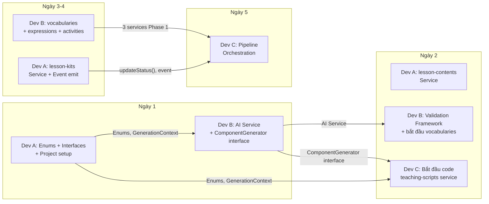

# 🔗 Bản Đồ Phụ Thuộc Giữa Các Dev

> Mỗi người đọc file này để biết: **mình cần giao gì, cho ai, khi nào** — và **mình đang chờ gì từ ai**.

---

## Sơ đồ phụ thuộc tổng quan



---

## Chi tiết từng ngày

### 📅 Ngày 1 — Nền tảng

| Dev | Cần hoàn thành trước cuối ngày 1 | Ai đang chờ | Giao gì |
|---|---|---|---|
| **Dev A** | ✅ Project setup (NestJS + MongoDB chạy được) | Dev B, Dev C | Repo + `.env.example` |
| **Dev A** | ✅ Enums: `LessonKitStatus`, `SupportLevel`, `ComponentType` | Dev B, Dev C | File enums trong `common/enums/` |
| **Dev A** | ✅ Interface `GenerationContext` | Dev B, Dev C | File `common/interfaces/generation-context.interface.ts` |
| **Dev A** | ✅ Base Response DTO + Exception Filter | Dev B, Dev C | Cấu trúc response chuẩn |
| **Dev B** | ✅ OpenAI Service (wrapper gọi API + retry) | Dev B (tự dùng cho ngày 2+) | Module `ai/` |
| **Dev C** | Viết schemas + DTOs + prompt templates | Không ai chờ | Chuẩn bị sẵn, chưa cần push |

> ⚠️ **Dev A push branch cuối ngày 1** để Dev B, C pull enums + interfaces về dùng.

---

### 📅 Ngày 2 — Bắt đầu rẽ nhánh

| Dev | Cần hoàn thành trước cuối ngày 2 | Ai đang chờ | Giao gì |
|---|---|---|---|
| **Dev B** | ✅ Interface `ComponentGenerator<T>` + `ValidationResult` | **Dev C** | File `common/validators/interfaces/` |
| **Dev B** | ✅ Hàm `validateAndRetry()` | Dev C (sẽ dùng ngày 3+) | File `common/validators/component-validator.ts` |
| **Dev A** | ✅ `lesson-contents` module hoàn chỉnh | Dev C (cần load context) | Service `findById()` |
| **Dev C** | Bắt đầu code `teaching-scripts` service | Không ai chờ | — |

> ⚠️ **Dev B push interface `ComponentGenerator` cuối ngày 2** để Dev C implement từ ngày 3.

---

### 📅 Ngày 3-4 — Code chính

| Dev | Cần hoàn thành | Ai đang chờ | Giao gì |
|---|---|---|---|
| **Dev A** | ✅ `lesson-kits` service: `create()`, `updateStatus()`, `updateCurrentStep()` | **Dev C** (pipeline gọi) | Các method public |
| **Dev A** | ✅ Emit event `lesson-kit.generate` khi create | **Dev C** (listen event) | Event name + payload |
| **Dev B** | ✅ `vocabularies` service hoàn chỉnh | **Dev C** (pipeline gọi) | `generate()`, `saveBulk()`, `deleteByKitId()` |
| **Dev B** | ✅ `classroom-expressions` service | **Dev C** (pipeline gọi) | Tương tự |
| **Dev C** | ✅ `teaching-scripts` + `student-questions` | Không ai chờ | — |

---

### 📅 Ngày 5 — Hoàn thiện

| Dev | Cần hoàn thành | Ai đang chờ | Giao gì |
|---|---|---|---|
| **Dev B** | ✅ `activities` service hoàn chỉnh | **Dev C** (pipeline gọi) | `generate()`, `saveBulk()`, `deleteByKitId()` |
| **Dev A** | ✅ `delete()` cascade + endpoint regenerate routing | **Dev C** | Endpoint gọi vào `regenerateService` |
| **Dev C** | ✅ Pipeline orchestration + Regenerate | Không ai chờ | — |

---

## Tóm tắt: Ai block ai?

```
Dev A ──block──▶ Dev B (ngày 1: enums, interfaces)
Dev A ──block──▶ Dev C (ngày 1: enums, interfaces)
Dev B ──block──▶ Dev C (ngày 2: ComponentGenerator interface)
Dev A ──block──▶ Dev C (ngày 3: lessonKitService methods + event)
Dev B ──block──▶ Dev C (ngày 5: 3 services Phase 1 hoàn chỉnh)
```

### Kết luận:

| Dev | Bị block bởi | Thời điểm cần nhận |
|---|---|---|
| **Dev A** | Không ai | — |
| **Dev B** | Dev A | Ngày 1 cuối ngày: enums + `GenerationContext` |
| **Dev C** | Dev A | Ngày 1 cuối ngày: enums + `GenerationContext` |
| **Dev C** | Dev B | Ngày 2 cuối ngày: `ComponentGenerator` interface |
| **Dev C** | Dev A | Ngày 3-4: `lessonKitService.updateStatus()`, event emit |
| **Dev C** | Dev B | Ngày 5: 3 services Phase 1 (vocabulary, expressions, activities) |

> 💡 **Dev C là người phụ thuộc nhiều nhất** — nên ngày 1-2 tập trung viết schemas/prompts, từ ngày 3 mới code logic chính.
> 
> 💡 **Dev A không bị block** bởi ai — nên có trách nhiệm push code sớm nhất để unblock team.
